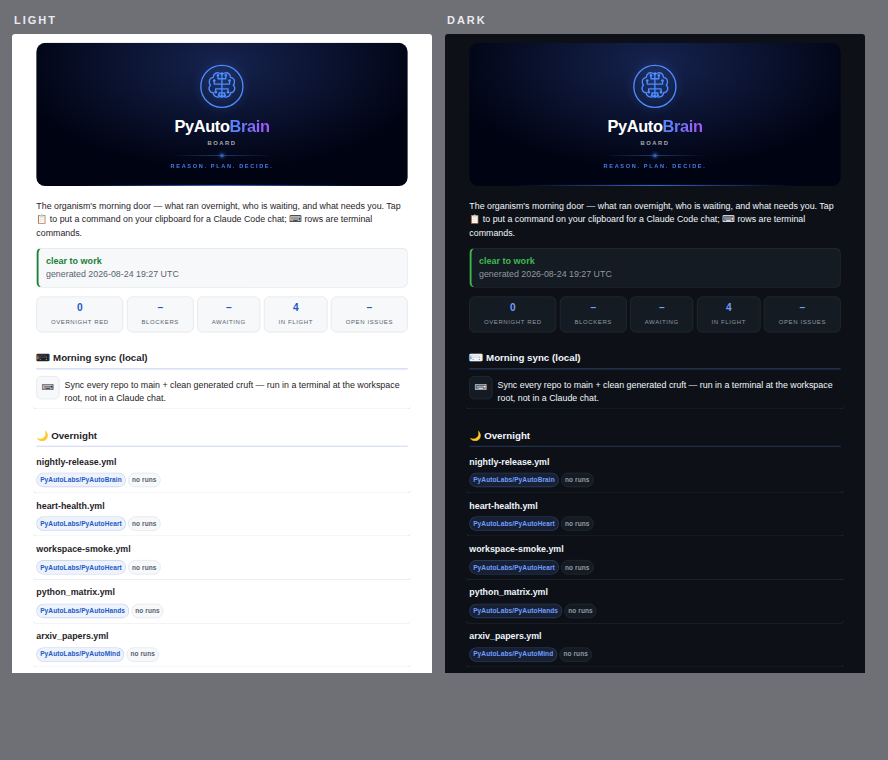
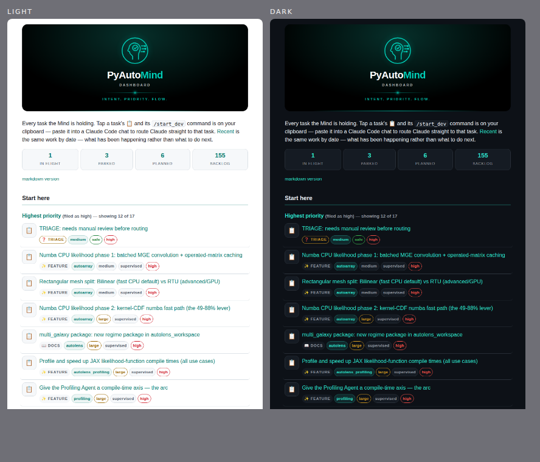
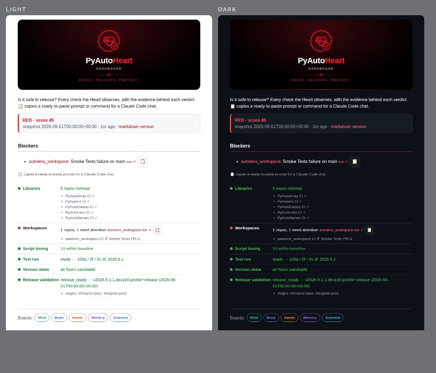
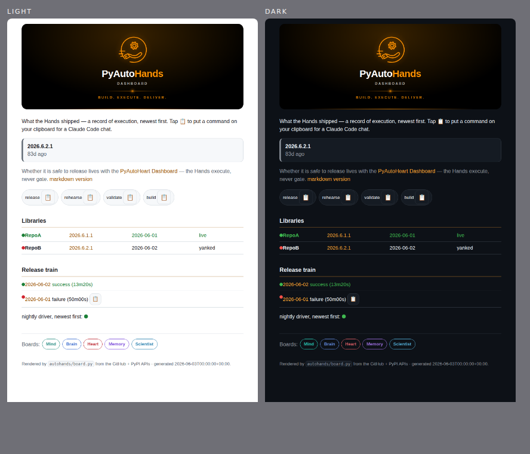
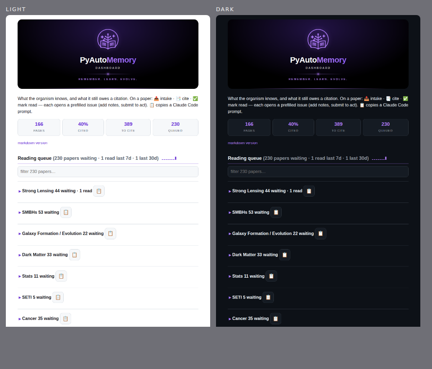
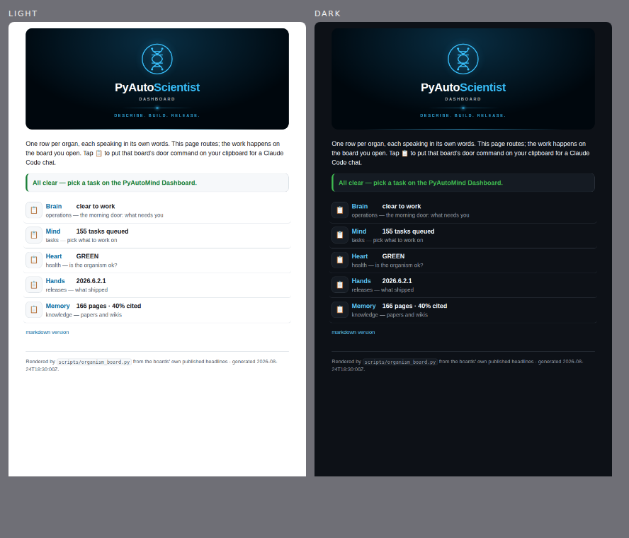

# The board family — what each one looks like

The six one-tap boards, rendered side by side in **light and dark**, so the
family can be judged on GitHub without opening six Pages URLs. Each board is
published from its own repo on its own cadence; this page is a **snapshot for
design review**, not a live surface — for live state, open the board itself.

The look is defined once, in [`../_theme.py`](../_theme.py): one stylesheet,
one hero, one set of components. Each organ contributes only its palette and
its mark — the glyph from its `logo.png`, redrawn as line art so it inherits
the accent and stays sharp at any size.

**What is real here, and what is not.** These were rendered in a sandbox with
no network access to the live sources, so:

| Board | Content in the shot |
|-------|---------------------|
| Mind | **real** — the Mind's own committed registry and `draft/` tree |
| Memory | **real** — the Memory's own wikis, bibliography and reading queue |
| Brain | **degraded** — its rows read GitHub and the Heart's badge, so every overnight row says "no runs" and readiness says "unreachable" |
| Heart | **sample** — rendered from the test suite's failing-snapshot fixture (a RED verdict), to show the tones a real red board uses |
| Hands | **sample** — the test suite's release fixture |
| Scientist | **sample** — a synthetic organ snapshot; the live router reads each board's published headline |

The *design* is real in every one; only the row content varies. A board whose
data source is unreachable says so rather than inventing a green — that
honesty is visible in the Brain shot, and is the intended behaviour.

---

## Brain — the operational board

The morning door: what ran overnight, who is waiting, what needs you.

## Mind — the task dashboard

Every task the Mind is holding, with its `/start_dev` command one tap away.

## Heart — the health board

Is it safe to release, and the evidence behind the verdict.

## Hands — the release board

What the Hands shipped — a record of execution, newest first.

## Memory — the knowledge board

What the organism knows, and what it still owes a citation.

## Scientist — the umbrella router

One row per organ, each speaking in its own words; this page only routes.

---

## Refreshing this page

There is no workflow behind it — a design snapshot that regenerated itself
would be a live surface, and the live surfaces are the boards. Re-render by
hand when the look changes:

1. render each board's `--html` (or, for a board whose sources are
   unreachable, its test fixture);
2. screenshot at 760px wide, once as-is and once with the
   `@media(prefers-color-scheme:dark)` blocks unwrapped — headless Chromium
   ignores `--force-prefers-color-scheme`, so a "dark" shot taken with that
   flag is silently a light one;
3. stitch each pair side by side and replace the PNG here.
