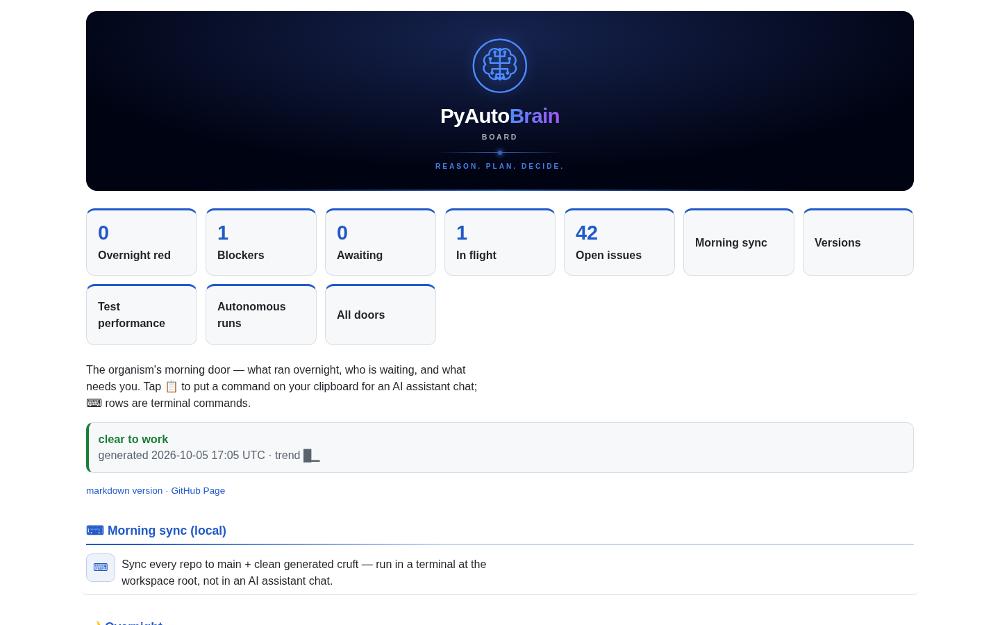
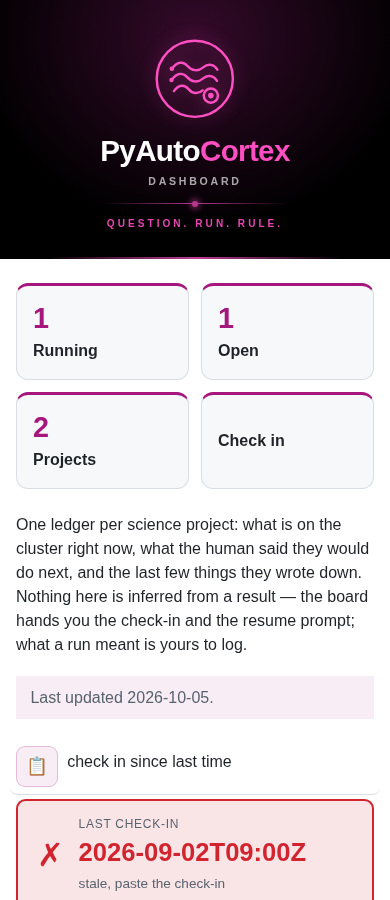

# Shared board navigation

Every board uses the same top order: organ logo/banner, slogan/orchestration
panel (including its freshness controls), section navigation cards, then its content. The cards are real links, not
JavaScript-only hidden tabs. Counts are optional; an unknown count is never
silently rendered as zero. Each owner supplies meaningful destinations and
keeps ownership of collection, health, freshness and action semantics.

## Component contract

`board/_theme.py::hero(key, kind, lede_html='', navigation=(), navigation_columns=None)` retains its
existing positional API. The optional keyword inserts
`navigation_cards(items, label='Board sections', columns=None)` directly after the masthead
and before the description. `section_layout(page, summaries=None)` composes the
finished owner HTML into the standard order, moving the orchestration panel above
these cards. Existing `hero` callers retain their positional API.

Each item is a mapping with `href` and `label`, plus optional `count` and
`context`. Text is escaped. Destinations accept local anchors, relative links
and HTTP(S) URLs, and reject active schemes, protocol-relative paths, backslashes
and control characters. `count=None` omits the value; `0` remains visible;
`'Unknown'` is a valid owner-supplied state. The theme does not calculate counts.

Cards share the organ's accent, a large target, visible keyboard focus and a
fluid grid. Owners may opt into 1–12 desktop columns through
`hero(..., navigation_columns=n)` or `navigation_cards(..., columns=n)`. This
applies at 64rem and wider; narrower screens retain fluid wrapping. Mind opts
into seven columns; other consumers keep their existing layout. They use the
[shared sizing standard](board-sizing.md). Do not
copy card CSS into another repository or use the accent to imply health. Keep
existing section anchors; only render links whose targets exist. Multiple
counts may link to one meaningful summary, as Ears' follow-through cards do.

## Collapsible major sections

Every owner passes its completed HTML through `section_layout`. The shared
adapter wraps major H2 groups in native `details`/`summary`, initially closed.
The original headings, stable anchors, content and copy payloads are retained;
existing disclosures and headings inside cards, tables and the orchestration
panel are not wrapped again. The adapter preserves the original HTML bytes
inside each group rather than serializing or interpreting domain content.
A section wrapper with one heading stays together; unwrapped heading groups end
at the next major heading, section, navigation, footer or script. Nested detail
controls retain their own state. The slogan panel itself stays visible.

Headers reuse optional counts already supplied by the owner on navigation cards.
An owner can additionally pass `summaries={section_id: {count, status, label}}`.
Zero remains visible; absent counts remain absent. Status and label are escaped,
and statuses have visible text as well as colour. The theme never aggregates
health or derives counts from prose. Existing descriptive heading summaries stay
visible. Mind's Start Here count is the number of unique tasks actually shown in
its two recommendation lists. Heart's Observed checks uses its own check states:
red, then yellow, then stale evidence, then unknown; green requires observed
passing evidence. This is independent of release readiness.

The shared JavaScript reveals ancestor disclosures on initial fragments, hash
changes and repeated link clicks. Navigation remains real anchor links. Native
summaries work by keyboard without JavaScript; JavaScript additionally handles
deep-link reveal and opening all content for printing, restoring closed states
afterwards. Other sections remain independently expandable.

## Renderer ownership and rollout

The authoritative membership is `config/policy.yaml` → `board.boards`.

| Board | Source owner | Integration |
|---|---|---|
| Brain | Brain `board/_board.py` | Shared component; section-owned counts plus count-free navigation |
| Mind | Brain `agents/conductors/intake/_intake.py` | Shared component; seven stable sections; human review nested under Backlog |
| Cortex | Brain `agents/conductors/cortex/_cortex.py` | Shared component; running/open/projects counts and check-in link |
| Ears | Ears `ears/board.py`, `ears/presentation.py` | Downstream reference migration; readable freshness below navigation |
| Memory | Memory `scripts/board.py` | Downstream shared-theme consumer |
| Heart | Heart `heart/dashboard.py` | Downstream shared-theme consumer; retain readiness semantics |
| Hands | Hands `autohands/board.py` | Downstream shared-theme consumer |
| Pulse | Pulse `pulse/board.py` | Downstream shared-theme consumer |
| Nerves | Nerves `scripts/board.py` | Downstream shared-theme consumer |
| Gut | Gut `scripts/board.py` | Downstream shared-theme consumer |
| Scientist | Scientist `scripts/organism_board.py` | Downstream shared-theme consumer |
| Eyes | Eyes `eyes/board.py` | Independent-renderer migration |
| Insight | Insight `insight/board.py`, `insight/theme.py` | Independent-renderer migration |

Consumer PRs depend on the Brain component merge. Source adoption does not
mean a board is live: refresh workflows must regenerate HTML and publication
must complete. The Mind task records that board-by-board rollout. Existing
copy/orchestration panels are a separate task; retain their payloads here.

Remove Ears' prominent "STALE — refresh required before judging the queue"
wording during its migration. Display a timestamp and a plain explanation below
navigation instead, while keeping the existing stale/unknown behavior and expiry
handler. Do not hide evidence age or change feeds to make the layout look fresh.

## Validation

Renderer checks cover safe links, escaped labels, optional/zero/unknown counts,
header ordering, section boundaries, zero/unknown summaries and live anchor destinations. Browser validation covers 390,
768, 820, 1024 and 1440px in light/dark, long labels, keyboard navigation and
count-free cards. Whole-page overflow and existing copy/disclosure behavior
remain part of each consumer's validation; a shared CSS change alone is not
proof of adoption.

The previous navigation-only rollout passed 1186 Brain tests and a strict Sphinx build.
Thirty Chromium cases exercised the three owner renderers at five widths in
light/dark: cards immediately followed the banner in that earlier layout, every target existed, every
card fit the viewport with a touch-sized target, keyboard activation navigated
to the section, and no whole-page overflow occurred. Screenshots below use
synthetic test data, not current operational state.

### Markdown source links

The shared section layout renders links labelled “markdown version” as small
document icons, preserving the owner’s URL. Section icons sit at the right of
the summary after its count/status badges; page-level source icons sit at the
right of their utility row. Each link has a “Markdown version” tooltip and
accessible name, visible keyboard focus and a 44px click target. Following the
link does not toggle the disclosure. Other Markdown links retain their labels.
This presentation is applied when a consuming board is next regenerated.
