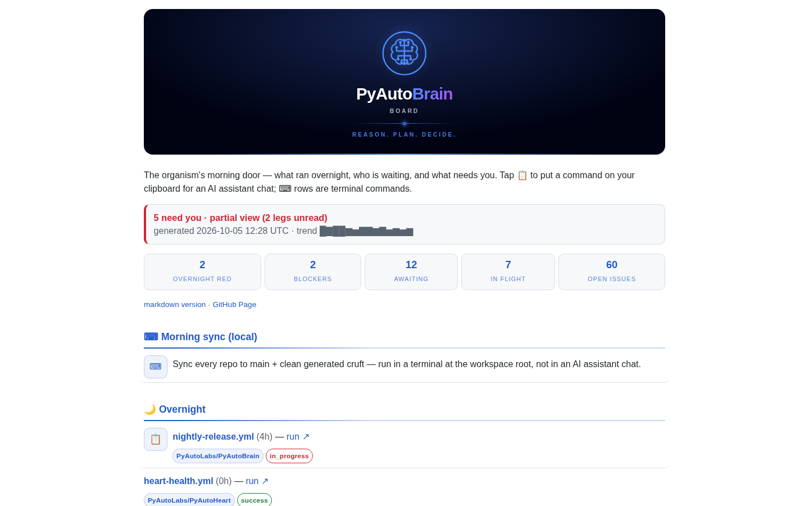
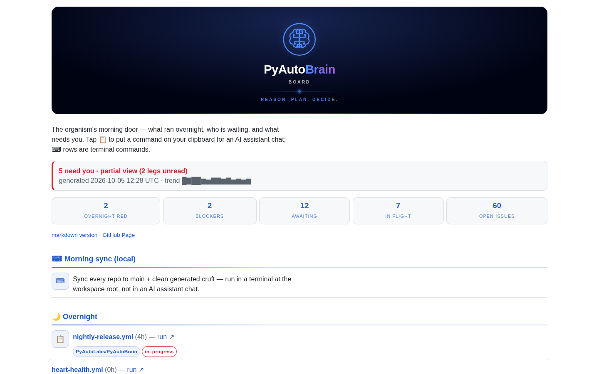
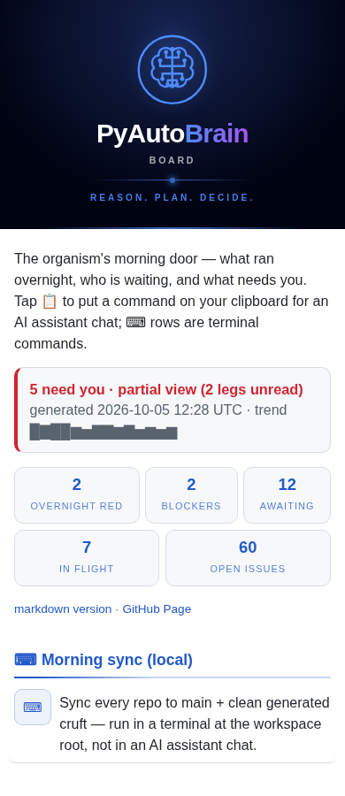

# Responsive board sizing

The standard separates **available page width** from **reading measure**. A
wide desktop maximum does not impose a minimum on a phone. At the default
16px root size, a board can grow to 1240px including its gutters; ordinary
paragraphs remain approximately 65 characters wide. Tables, metric rows and
status panels may use the full available width.

## Shared contract

`board/_theme.py::css(organ)` owns these presentation tokens. The Python API,
board data, status semantics, copy payloads and publication workflows do not
change.

| Token / rule | Value | Purpose |
|---|---|---|
| `--board-max` | `77.5rem` (1240px normally) | Border-box outer maximum, centred; no minimum page width |
| `--board-gutter` | `1rem`, then `1.5rem` at `46rem` | 16px phone / 24px tablet and desktop inset |
| `--board-measure` | `65ch` | Maximum for paragraphs and explicit `.board-prose` blocks |
| Hero breakpoint | Existing `46rem` (736px normally) | Switch from edge-to-edge masthead to inset rounded masthead; also switches gutters |
| Recent-row breakpoint | Existing `34rem` (544px normally) | Stack the shared recent-task table on phones |
| Overflow policy | Inherited `overflow-wrap:anywhere` | Wrap long text without hiding content or masking whole-page overflow |

The width includes padding because the theme uses `border-box`. At 1440px,
the centred board is 1240px wide and its data area is 1192px. At 390px, the
board is 390px wide and its content area is 358px. Relative units also respond
to a changed browser root font size; they are not fixed device classifications.

Paragraph sizing uses the low-specificity `:where(p,.board-prose)` selector.
An owner can override it for a justified component. Hero paragraphs and
`.verdict` panels deliberately retain their component width. Applying
`.board-prose` to an explanation or prompt wrapper also constrains non-paragraph
text; do not apply it to a container holding data tables or metrics. Existing
copy controls, native disclosures and focus behavior are preserved.

Dense tables must either reflow in their renderer or have a **local**, labelled
scroll region, keyboard reachable with `tabindex="0"` when needed. Give users a
visible indication that more columns are available; retain meaningful row
labels and make actions reachable by touch and keyboard. Focused actions should
scroll into view. Do not use `overflow-x:hidden` on the page to conceal layout
failures. A table's `max-width:100%` alone cannot overcome intrinsic minimum
column widths. The shared theme cannot supply accessible wrapper markup to an
independent renderer.

## Adoption matrix

Membership and order come from `config/policy.yaml → board.boards` (13 entries
on 2026-10-05). Paths below are relative to the named repository. Importing
Brain solely to validate `state.json` or build footer links is **not** theme
adoption. This task edits Brain only; other repository entries are audit results.

| Board | Renderer / sizing owner | Adoption and remaining work | Normal publication path |
|---|---|---|---|
| Brain | `PyAutoBrain/board/_board.py` → shared theme | Automatic at next render | `brain_board.yml` renders and publishes |
| Mind | `PyAutoBrain/agents/conductors/intake/_intake.py` → shared theme | Automatic sizing; expanded `table.bundle` has pre-existing phone overflow; separate renderer follow-up | Mind `dashboard_refresh.yml` regenerates committed HTML, then `pages_dashboard.yml` copies it |
| Cortex | `PyAutoBrain/agents/conductors/cortex/_cortex.py` → shared theme | Automatic; no sizing override found | Cortex refresh regenerates HTML, then Pages copies it |
| Memory | `PyAutoMemory/scripts/board.py` → shared theme + `_EXTRA_CSS` | Automatic; local components retain identity | `knowledge_board.yml` renders with Brain checkout |
| Eyes | `PyAutoEyes/eyes/board.py::CSS` | Independent `main{max-width:1200px}` with 16px gutters; explicit adoption and overflow repair follow-up | `pages_dashboard.yml` publishes generated output; Brain checkout is for feed validation |
| Ears | `PyAutoEars/ears/board.py` + `ears/presentation.py::CSS` | Shared theme plus matching 1240px outer override. Keep initially; later replace duplicate dimensions with tokens | `pages.yml` renders with Brain checkout |
| Heart | `PyAutoHeart/heart/dashboard.py` → shared theme | Automatic; section-body rules are component padding, not an outer width override | `heart-health.yml` renders with Brain checkout |
| Hands | `PyAutoHands/autohands/board.py` → shared theme | Automatic; no outer override found | `release_board.yml` renders with Brain checkout |
| Pulse | `PyAutoPulse/pulse/board.py` → `pulse/setup_browser.py::theme()` | Automatic: current main already imports Brain; intake's independent-width assessment is obsolete | Refresh regenerates HTML using Brain, then Pages copies it |
| Insight | `PyAutoInsight/insight/board.py` → `insight/theme.py` | Independent 1200px main container and 16px gutters; explicit adoption and overflow repair follow-up | Refresh generates output; Pages copies it and validates feed with Brain |
| DNA | `PyAutoDNA/dna/board.py` → shared theme | New consumer; requires matching Brain registration and DNA merge, then publication verification | `pages.yml` renders and publishes |
| Nerves | `PyAutoNerves/scripts/board.py` → shared theme | Automatic; no outer override found | `nerves_board.yml` renders with Brain checkout |
| Gut | `PyAutoGut/scripts/board.py` → shared theme | Automatic; no outer override found | `gut_board.yml` renders with Brain checkout |
| Scientist | `PyAutoScientist/scripts/organism_board.py` → shared theme | Automatic for the organ board; embedded/cockpit presentation needs its own later verification | `organism_board.yml` renders with Brain checkout |

Shared-theme consumers use the Brain checkout selected by their existing
render workflow. Most use the default branch; Cortex's refresh can select a
matching feature branch. Merging Brain changes future renders, not already
published HTML. Mind, Cortex and Pulse require **regeneration before
publication**; merely rerunning a workflow that copies committed HTML will not
update CSS. No publication workflow or deployment is dispatched by this task.

Ears retains a small intentional transitional difference: its local gutter
breakpoint is 760px, while the shared breakpoint is 736px. Its phone tables keep
740px conversation and 650px coverage minima within local scroll containers.
Off-screen columns remain a mobile interaction trade-off. The initial Brain
change preserves those rules; aligning Ears' breakpoint and removing duplicated
sizing belong in its adoption follow-up.

## Evidence and limits

[Machine-readable results](board-sizing/results.json) record source URLs,
SHA-256 hashes and measurements. The audit downloaded all 13 public Pages
HTML documents on 2026-10-05, then made local before/after copies. In shared
consumers, only the theme base was replaced in its original stylesheet
position; consumer rules and markup were retained. Eyes and Insight were
unchanged controls. These are controlled layout previews, not deployment or
fresh-data evidence.

Chromium checked 260 combinations: 13 boards × five widths × two colour
schemes × before/after. All native disclosures were opened, including populated
tables. Network requests were blocked to hold the snapshots stable. Accordingly,
Eyes' missing image placeholders do **not** establish loaded-gallery behavior;
that follow-up must repeat checks with real images and embedded views.

| Shared board width | Before | After | After gutter |
|---|---:|---:|---:|
| 390px viewport | 390px | 390px | 16px |
| 768px | 704px | 768px | 24px |
| 820px | 704px | 820px | 24px |
| 1024px | 960px | 1024px | 24px |
| 1440px | 960px | 1240px | 24px |

Ears already matched these sampled widths and remains unchanged. No new
whole-page overflow cases appeared. Ten boards fit at every sampled width in
both schemes. Three existing exceptions prevent claiming family-wide compliance:

- **Mind:** opening bundle tables produces 131px phone overflow before and
  after. `td.facet{white-space:nowrap}` contributes to the table's minimum
  width. Follow-up: reflow bundle rows or add labelled local scrolling while
  keeping each prompt's actions reachable.
- **Eyes:** long code paths and gallery content overflow in the offline
  expanded snapshot. Follow-up: adopt the shared sizing tokens, wrap long
  paths, constrain grid/image minimum sizes, then validate with images loaded.
- **Insight:** the independent layout overflows by 548px at 390px, 170px at
  768px and 118px at 820px, identically before/after. Follow-up: fix container
  minimum sizing/local scrolling as part of adopting the shared layout.

Fourteen additional synthetic cases (light/dark at the five requested widths
plus both sides of 736px) passed. They exercise long titles and URLs, 65ch
prose, expanded explanations, a dense 740px table, copy buttons and keyboard
scrolling. Six published-page interaction cases (Brain/Ears/Pulse, light/dark,
390px) verified Enter toggles disclosures, Enter invokes the existing copy
handler, and the focused primary copy button is within the viewport. Clipboard
writes were intercepted in the test browser and checked for a nonempty payload;
this does not send a command or invoke an orchestration action. These checks
are not a complete screen-reader or physical touch-device accessibility audit.

### Visual comparison

Desktop before:



Desktop after (data uses the wider page; paragraphs retain a reading measure):



Phone after (390px):



### Repeating the browser checks

The optional [layout checker](board-sizing/check.cjs) and
[interaction checker](board-sizing/interactions.cjs) require Playwright and
Chromium in a scratch directory, not a production dependency. Run there with
`node check.cjs` and `node interactions.cjs`. Inputs are `published.json`
(the `snapshots` array in the results file), paired `before/<board>.html` and
`after/<board>.html` snapshots, plus `theme.css` / `theme.js` emitted from the
candidate `_theme.css('brain')` / `_theme.JS`. The layout checker measures both
versions without changing content, writes `layout-results.json` and representative
screenshots; it fails on new overflow cases and reports existing exceptions. The interaction
checker asserts geometry and keyboard behavior and writes
`interaction-results.json`. Preserve source hashes when refreshing evidence.

## Repository validation

The targeted theme/Brain/Mind renderer suite passed **213 tests**. The full Brain
suite passed **1178 tests** with the task activation's explicit checkout
overrides removed from the test process, matching the fixture-driven CI
configuration. An initial run with `PYAUTO_MIND` still set failed the grouped
checkout discovery fixture (606 passed before stop); it preferred the explicit
worktree override to the test's temporary Mind, as designed. No product source
was changed to address that environment mismatch.

```bash
source ../activate.sh
env -u PYAUTO_MIND -u PYAUTO_HEART -u PYAUTO_HANDS \
    -u PYAUTO_BRAIN -u PYAUTO_ROOT \
    python -m pytest tests/ -q -x -n auto
```

This presentation-only organ change has no modelling-library API or workspace
script impact. Its downstream smoke evidence is the 13-board layout audit and
Brain/Ears/Pulse interaction checks above, rather than scientific sampler runs.

## Rollout sequence

1. Review and merge the Brain standard through human `/prm`; allow existing
   render/publication schedules to consume it. Verify the resulting published
   pages before declaring adoption complete.
2. Address Mind's bundle table in a separate Brain renderer task. Adopt the
   standard in Eyes and Insight through separate repository tasks, retaining
   their identities and existing data/action contracts. Their existing overflow
   makes these required compliance follow-ups, not optional polish.
3. Deduplicate Ears sizing and align its breakpoint in a small adoption task;
   preserve its table-local scrolling decision. Recheck embedded/cockpit views
   using actual iframe widths and loaded assets.

Each follow-up needs its own approved task, tests and PR. No independent-renderer
rollout, deploy or merge is authorized by this implementation alone.
