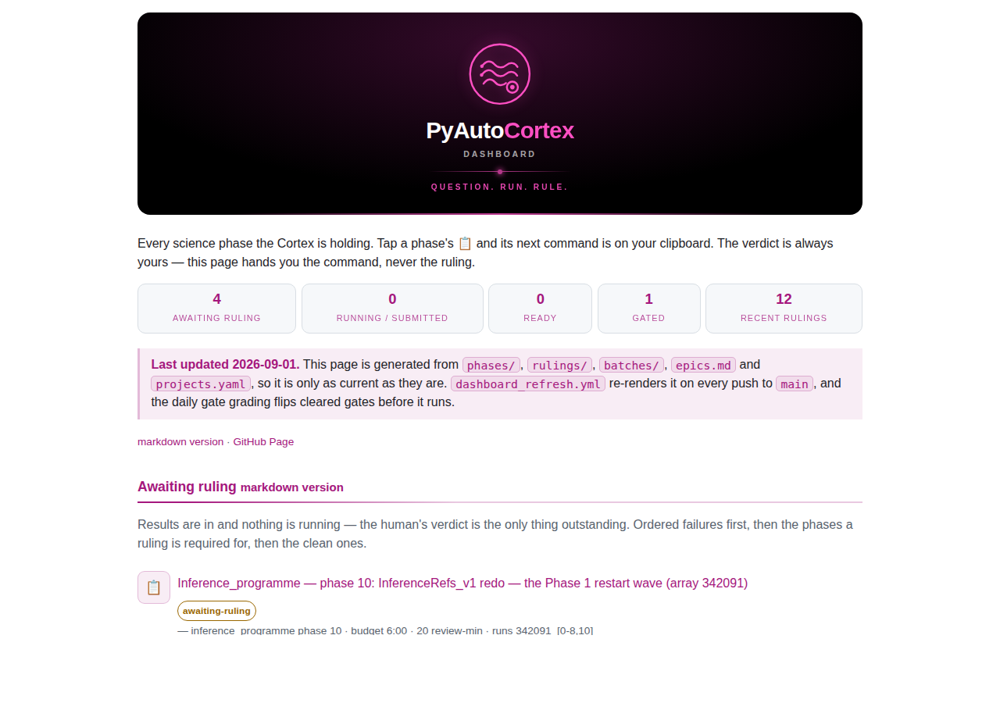

# Cortex — PyAutoCortex

**What it owns:** the *science body map* (`projects.yaml` — each science
project's repo and remote, local path, RAL root, laptop mirror, sync CLI,
ledger and witness file) and the **rulings of record** for every science run.
The Cortex is the science mirror of the Mind: the Mind holds prompts and PRs,
the Cortex holds runs and rulings. *The Mind decides what to build, the Brain
routes the work and executes nothing, the Cortex learns what is true.*

**Repo:** [PyAutoLabs/PyAutoCortex](https://github.com/PyAutoLabs/PyAutoCortex)
· schemas and grammars:
[REFERENCE.md](https://github.com/PyAutoLabs/PyAutoCortex/blob/main/REFERENCE.md)

## The defining function: learning

A science phase begins as a **pre-registered question with a witness** — the
file or number that will settle it — before anything is submitted. The run
happens on RAL or the laptop; its evidence (`.err`, checkpoints, witness
JSONs, figures) is **pulled** to the laptop; the human inspects it and records
a **ruling**: *accept*, *rerun* or *drop*. That ruling is the organism
learning something.

The unit is a **phase** of a **project** — one markdown file under
`phases/<project>/` that spawns **runs** (SLURM job ids) and ends in a ruling.
Development work a phase waits on stays in the Mind, named here only as a gate.

## The state model

A phase moves through ten states, and the sentence is the lifecycle:
**planned** until its gates are written, **gated** while they are open,
**ready** once they clear, **submitted** when the human launches the run,
**running** while it is on the cluster, **pulled** when the evidence reaches
the laptop, **awaiting-ruling** while it sits on the review board, and then
**accepted**, **rerun** or **dropped** by the human's word. Two rules make the
model worth having:

- **`scripts/cortex.py move` owns every edge except the last three.**
  `accepted`, `rerun` and `dropped` are reachable **only** through
  `scripts/cortex.py rule`, which writes the ruling file and the phase's
  `Ruling:` in one act — a phase cannot be marked accepted with no ruling of
  record to point at.
- **`accepted` is not terminal; `dropped` is.** A later ruling may supersede an
  acceptance (that is what a rewind is), and a `rerun` returns to `ready`
  keeping its run history. Reviving a dropped phase means a new phase number.

`legacy` and `legacy_wrong` are states of a **run**, never of a phase — the
quarantine for results produced before a rule the project has since adopted.
`scripts/cortex.py check` enforces the table and its invariants: a witness
before `submitted`, a cleared or overridden gate before `ready`, a ruling
before any terminal state.

## The ruling-of-record rule

**A verdict recorded only outside the Cortex does not exist.** Project ledgers
(a `DECISIONS.md`, a `RESULTS.md`, a project wiki's `state.md`) remain as
scientific commentary — evidence, reasoning, consequences — and cite the ruling
id. Rulings are append-only: a wrong ruling is superseded by a new one and
never edited, and the ledger-merge classifier treats any modification or
deletion under `rulings/` as code, which is a human's turn.

## Gates

A science phase declares what it waits on as GitHub issue and PR references in
its `Gates:` header — `Repo#N` under the default owner, or a full issue/PR URL
— the same grammar the Mind's `Blocked-by:` uses, sharing its regular
expression verbatim. A **daily grading job** (`gates_grade.yml`, 06:47 UTC)
polls those refs and flips a phase `gated → ready` when every one has closed,
stamping `Gates-cleared:`; a cleared gate that reopens flips it back. It is the
one scheduled job in the repo that mutates the ledger, it may make no other
move, and an unreadable ref fails closed — the phase is skipped and the run
goes red so a human sees the ref.

The Mind learns nothing about the Cortex beyond a **render-time badge** —
"gates a Cortex phase" on the development issue in question. One grammar, one
direction.

## What it never does

- **It never dispatches.** No verb in the Cortex or in its conductor submits a
  job, cancels one, or touches RAL. The submission is the human's act at the
  laptop, through the project's own sync CLI, and is recorded afterwards.
- **It never holds data.** The science project trees, their outputs, mirrors
  and checkpoints stay where they are; `projects.yaml` points at them. What is
  committed here is the question, the run ids, the verdict.
- **It never runs under an autonomy level.** Every phase is `Lane: local-dev`;
  the review happens at the laptop, on evidence in the human's hands. The
  autonomy cap is not consulted when a science member is admitted to a slot: a
  science run is supervised by definition, and no autonomous ship gate can
  produce a ruling.
- **It never reads `sacct` as health.** SLURM says a process exited, not that
  it produced science: a run is *delivered* only when the `.err` is clean, wall
  is inside `Budget:`, the version stamp is there and the checkpoint is sane.

## Driving it

The Cortex *holds runs and rulings*; it decides nothing. The Brain's **cortex
conductor** (`bin/pyauto-brain cortex`, `/cortex`) does the reasoning — the
same split as **Heart ↔ vitals** and **Gut ↔ hygiene**.

| Verb | What it does |
|------|--------------|
| `checkin [--dry-run \| --apply] [--push \| --no-push] [--project KEY] [--skip-pull]` | **The door.** Pull every active project through its own sync CLI (streamed; one project's failure does not stop the sweep), score every live phase, move what came back, re-render the board, push the ledger where the rule allows, and print a summary **by project** with the copy-ready prompt each phase's state already has. `--dry-run` (the default) says what it would do and reaches nothing |
| `census` | What the Cortex is holding — phases by state, rulings, projects, epics |
| `dashboard --check` \| `--apply` | The generated board, `dashboard.md` + `dashboard.html`. `--check` exits **1** on drift — the contract the Cortex's `dashboard_refresh.yml` runs on. The two pages are generated: never hand-edit them |
| `gates` | The refs each gated phase waits on and the URL each resolves to — read-only and offline. A human opens them and, when they have closed, types `cortex.py move <phase> ready` |
| `collect [--pull] [--apply] [--phase REL]` | **The check-in.** What came back, one block per phase: six legs (`err`, `wall`, `version`, `checkpoint`, `resume`, `witness`) each `PASS`/`FAIL`/**`UNOBSERVABLE`**, the witness readout and a blank ruling line. Default scope is every `submitted \| running` phase; `--pull` runs each project's own sync CLI; `--apply` moves each phase `running → pulled → awaiting-ruling`. Exit **1** = a phase the human must look at |

**Checking in is one command.** `pyauto-brain cortex checkin --apply` pulls
every active project through its own sync CLI, scores every phase the Cortex
believes is out there against its pre-registered witness, moves what came back
to `awaiting-ruling`, re-renders the board, pushes the ledger on
`claude/checkin-<date>` when `gh` is logged in and the checkout is clean on
`main`, and ends with a by-project summary the human reads and pastes from —
then they rule with `scripts/cortex.py rule`. It needs no record, no slot and
no packet.

A review-slot apparatus — a rolling board with its own record under `batches/`,
a scored packet page, partial reviews and carry-forward — was built on the
batch conductor in 2026-08 and retired on 2026-09-03: 0 slots were ever opened
by the conductor, 0 rulings came from a packet, and all 22 rulings were reached
in a live session. `batches/` is kept as read-only history because 13 rulings
cite its words.

## The board

Every phase the Cortex is holding on one page — awaiting ruling first, then
running, ready, gated, the ruling ledger, the epics (each linking its Mind
half) and the project map — published at
<https://pyautolabs.github.io/PyAutoCortex/>. It hands out the next command;
the verdict is never on the page.

## For an adopter

Like Mind, Memory and Gut, the Cortex is an **instance organ** — inherently
yours. You do not fork this repo's contents; you create your own Cortex with
the same shape — a body map of your projects, a phase file per question, a
place to write what you decided — and hold your own rulings in it.

The birth of this organ is tracked in the
[cortex-birth epic ledger](https://github.com/PyAutoLabs/PyAutoMind/blob/main/complete/archive/epics/cortex_birth_epic.md).
